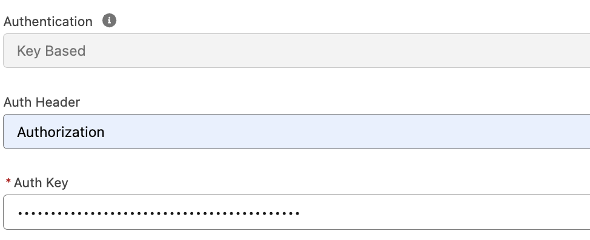

# Einstein AI Platform

Artificial intelligence is becoming increasingly personalized and specialized. At Salesforce we recognize the growing need for businesses and developers to integrate their chosen large language models (LLMs) into the Einstein AI Platform. To address this need, we're sharing API specifications, sample code, and other developer tools with the open-source community.

## LLM Open Connector

LLM Open Connector is a new option for connecting customer and partner LLMs using our existing Bring Your Own Large Language Model (BYOLLM) feature in Einstein Studio Model Builder. 

The BYOLLM Open Connector is a commitment to community-driven growth and innovation. By allowing users to integrate any LLM—from those models hosted on major cloud platforms to those models developed in-house—we're opening up a world of possibilities for enhanced, bespoke AI applications. 

At this time, BYOLLM offers four built-in options for customers wanting to connect their external LLMs to Salesforce – OpenAI, Azure OpenAI, Google Gemini Pro, and Anthropic Claude on Bedrock. While these options cover a broad swath of the LLM landscape, there are many high quality LLMs that we have not integrated. Instead of doing a point-to-point integration with each of these providers, we have embraced an open connector strategy that allows us to scale easily and lets anyone across the world integrate their own LLM with Salesforce.

This capability not only caters to the needs of large enterprises looking to leverage specific models like IBM Granite or Databricks DBRX, but also supports smaller teams eager to experiment with open-source models. With features designed to ensure ease of use, such as a streamlined user experience in Einstein Studio and API specifications closely based on the OpenAI API, this connector empowers our users to enhance their AI-driven applications while maintaining high standards of security and compatibility.

Check out this post on the Salesforce Developers Blog for more info: [Use the LLM Open Connector to Build Generative AI Solutions Using Your Preferred Models and Platforms](https://developer.salesforce.com/blogs/2024/10/build-generative-ai-solutions-with-llm-open-connector).

### Usage

1. Clone this repository.
2. Implement an HTTP REST service using the [LLM Open Connector OpenAPI specification](api-specs/llm-open-connector/llm-open-connector.yml). This service can contain the `chat/completions` endpoint. The `/chat/completions` endpoint is used for chat-based use cases. It is required for Prompt Builder and Agentforce.
> **Note**: To connect to a remote model endpoint, a standard HTTPS 443 port is required.
3. Test your service connection using Bring Your Own Large Language Model (BYOLLM) in Einstein 1 Studio.
   - Blog post: [Bring Your Own Large Language Model in Einstein 1 Studio](https://developer.salesforce.com/blogs/2024/03/bring-your-own-large-language-model-in-einstein-1-studio)
   - Help content: [Bring Your Own Large Language Model](https://help.salesforce.com/s/articleView?id=sf.c360_a_ai_foundation_models.htm)

You can now use your LLM from anywhere that can access generative models from Einstein Studio.

### FAQs

Have a question that you don’t see here? Create a [GitHub Issue](https://github.com/salesforce/einstein-platform/issues), and we’ll take a look.

**Q: Which IP addresses do I need to add to a network Access Control List?**
A: For a list of IP addresses to add to an allowlist, see the BYO Models and Open Connector IP Addresses table in the [Salesforce Core Services - IP Addresses and Domains to Allow](https://help.salesforce.com/s/articleView?id=000384438&type=1), knowledge article.

**Q: What unit of measure should I use for the timestamp?**
A: Use seconds for The Unix timestamp in the created attribute of the response. If your model endpoint returns a timestamp in milliseconds, you’ll need to convert it. For more information, see [the specification](https://opensource.salesforce.com/einstein-platform/docs/apis/llm-open-connector).

**Q: Does the model endpoint URL have to end in `/chat/completions`?**
A: Yes, according to the Open Connector specification, a supplied model endpoint must end in `/chat/completions`.

**Q: Can I use a Bearer token for authentication?**
A: Yes, to use a bearer token instead of an API key, enter “Authorization” in the Auth Header field and enter “Bearer `<token>`”  in the Auth Key field. For example, `Bearer 1234567`.



**Q: Why am I getting an error for the usage object?**
A: The Open Connector specification contains slightly different usage object fields compared to OpenAI's API specification. Please use the usage object as defined in the Open Connector specification.


## Cookbook

As a companion to this repo, the [Einstein Platform Cookbook](https://opensource.salesforce.com/einstein-platform/) features sample code, recipes, and formatted versions of the API specifications.

Sample content:

- Specification: [LLM Open Connector API](https://opensource.salesforce.com/einstein-platform/docs/apis/llm-open-connector)
- Recipe: [LLM Open Connector + Hugging Face](https://opensource.salesforce.com/einstein-platform/huggingface)
- Recipe: [LLM Open Connector + Amazon Web Services](https://opensource.salesforce.com/einstein-platform/aws)
- Recipe: [LLM Open Connector + Groq](https://opensource.salesforce.com/einstein-platform/groq)
- Recipe: [LLM Open Connector + SambaNova](https://opensource.salesforce.com/einstein-platform/sambanova)
- Recipe: [LLM Open Connector + IBM](https://opensource.salesforce.com/einstein-platform/ibm)

## Models API

The Models API connects your application to large language models (LLMs) through the Einstein Trust Layer. It supports the BYOLLM feature of Einstein Studio, including models enabled through the [LLM Open Connector](#llm-open-connector).

The Models API is designed with flexibility and extensibility in mind, and it complements existing Salesforce AI offerings for developers. Prompt Builder and the Prompt Template Connect API are effective for fast prompt management and Agentforce provides a customizable and interactive chat experience. The Models API provides additional features like embeddings and chat generations with history which enable developers to architect custom AI applications and deploy them via Lightning web components.

The Models API is currently available via Apex methods and REST endpoints. 

To get started, see the [Models API Developer Guide](https://developer.salesforce.com/docs/einstein/genai/guide/models-api.html). To get hands-on in Trailhead, try building your own Lightning web component with [Get Started with the Models API](https://trailhead.salesforce.com/content/learn/modules/get-started-with-einstein-models-api).

## Policies

### Contribute

Your contributions to this repository are welcome! Refer to the [Contributing Guide](CONTRIBUTING.md) and [Code of Conduct](CODE_OF_CONDUCT.md) to get started.

If you like the resources that you see here, consider adding a ⭐ on GitHub. It helps other people discover them!

### Security

Please report any security issue to [security@salesforce.com](mailto:security@salesforce.com)
as soon as it is discovered. This library limits its runtime dependencies in
order to reduce the total cost of ownership as much as can be, but all consumers
should remain vigilant and have their security stakeholders review all third-party
products (3PP) like this one and their dependencies.

### License Info

All code in this repository is licensed under an [Apache License v2](LICENSE) license.

### Salesforce-authored Code

The shorter version of license text must be added as a comment to all Salesforce-authored source code and configuration files that support comments. This rule applies to file formats like HTML, CSS, and JavaScript, which aren't exactly source code, but are still critical to the project.

```
/*
 * Copyright (c) 2023, Salesforce, Inc.
 * SPDX-License-Identifier: Apache-2
 *
 * Licensed under the Apache License, Version 2.0 (the "License");
 * you may not use this file except in compliance with the License.
 * You may obtain a copy of the License at
 *
 *     http://www.apache.org/licenses/LICENSE-2.0
 *
 * Unless required by applicable law or agreed to in writing, software
 * distributed under the License is distributed on an "AS IS" BASIS,
 * WITHOUT WARRANTIES OR CONDITIONS OF ANY KIND, either express or implied.
 * See the License for the specific language governing permissions and
 * limitations under the License.
 */
```

### Other Legal Disclaimers

Rights of ALBERT EINSTEIN are used with permission of The Hebrew University of Jerusalem / [CMGWorldwide.com](http://cmgworldwide.com/).
