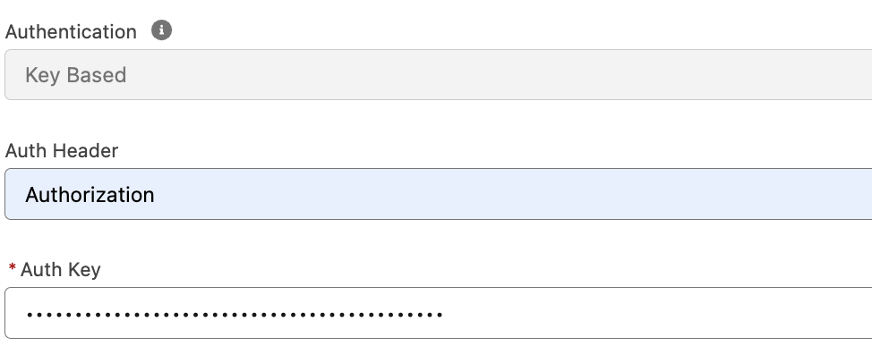

The [Open Connector Cookbook](https://opensource.salesforce.com/einstein-platform/) is where Salesforce shares example code and recipes for building with the LLM Open Connector. This blog is generated based on the contents of the open source [einstein-platform](https://github.com/salesforce/einstein-platform) repository on GitHub.

## LLM Open Connector

LLM Open Connector is a new option for connecting customer and partner LLMs using our existing Bring Your Own Large Language Model (BYOLLM) feature in Einstein Studio Model Builder.

The BYOLLM Open Connector is a commitment to community-driven growth and innovation. By allowing users to integrate any LLM—from those models hosted on major cloud platforms to those models developed in-house—we're opening up a world of possibilities for enhanced, bespoke AI applications.

At this time, BYOLLM offers four built-in options for customers wanting to connect their external LLMs to Salesforce – OpenAI, Azure OpenAI, Google Gemini Pro, and Anthropic Claude on Bedrock. While these options cover a broad swath of the LLM landscape, there are many high quality LLMs that we have not integrated. Instead of doing a point-to-point integration with each of these providers, we have embraced an open connector strategy that allows us to scale easily and lets anyone across the world integrate their own LLM with Salesforce.

This capability not only caters to the needs of large enterprises looking to leverage specific models like IBM Granite or Databricks DBRX, but also supports smaller teams eager to experiment with open-source models. With features designed to ensure ease of use, such as a streamlined user experience in Einstein Studio and API specifications closely based on the OpenAI API, this connector empowers our users to enhance their AI-driven applications while maintaining high standards of security and compatibility.

Check out this post on the Salesforce Developers Blog for more info: [Use the LLM Open Connector to Build Generative AI Solutions Using Your Preferred Models and Platforms](https://developer.salesforce.com/blogs/2024/10/build-generative-ai-solutions-with-llm-open-connector).

### Usage

1. Clone the [einstein-platform](https://github.com/salesforce/einstein-platform) repository.
2. Implement an HTTP REST service using the [LLM Open Connector OpenAPI specification](/docs/apis/llm-open-connector). This service can contain the `chat/completions` endpoint. The `/chat/completions` endpoint is used for chat-based use cases. It is required for Prompt Builder and Agentforce.
   > **Note**: To connect to a remote model endpoint, a standard HTTPS 443 port is required.
3. Test your service connection using Bring Your Own Large Language Model (BYOLLM) in Einstein 1 Studio.
   - Blog post: [Bring Your Own Large Language Model in Einstein 1 Studio](https://developer.salesforce.com/blogs/2024/03/bring-your-own-large-language-model-in-einstein-1-studio)
   - Help content: [Bring Your Own Large Language Model](https://help.salesforce.com/s/articleView?id=sf.c360_a_ai_foundation_models.htm)

You can now use your LLM from anywhere that can access generative models from Einstein Studio.

### FAQs

Have a question that you don't see here? Create a [GitHub Issue](https://github.com/salesforce/einstein-platform/issues), and we'll take a look.

**Q: Which IP addresses do I need to add to a network Access Control List?**

- A: For a list of IP addresses to add to an allowlist, see the BYO Models and Open Connector IP Addresses table in the [Salesforce Core Services - IP Addresses and Domains to Allow](https://help.salesforce.com/s/articleView?id=000384438&type=1), knowledge article.

**Q: What unit of measure should I use for the timestamp?**

- Use seconds for The Unix timestamp in the created attribute of the response. If your model endpoint returns a timestamp in milliseconds, you'll need to convert it. For more information, see [the specification](/docs/apis/llm-open-connector).

**Q: Does the model endpoint URL have to end in `/chat/completions`?**

- Yes, according to the Open Connector specification, a supplied model endpoint must end in `/chat/completions`.

**Q: Can I use a Bearer token for authentication?**

- Yes, to use a bearer token instead of an API key, enter "Authorization" in the Auth Header field and enter "Bearer `<token>`" in the Auth Key field. For example, `Bearer 1234567`.

  

**Q: Why am I getting an error for the usage object?**

- The Open Connector specification contains slightly different usage object fields compared to OpenAI's API specification. Please use the usage object as defined in the Open Connector specification.

## Contributing

Your contributions to the Cookbook and the open-source repository are welcome! Refer to the [Contributing Guide](https://github.com/salesforce/einstein-platform/blob/main/CONTRIBUTING.md) and [Code of Conduct](https://github.com/salesforce/einstein-platform/blob/main/CODE_OF_CONDUCT.md) to get started.

If you like the resources that you see here, consider adding a ⭐ on GitHub. It helps other people discover them!

See Also:

- [Generative AI Developer Guide](https://developer.salesforce.com/docs/einstein/genai/overview)
- [Einstein Platform GitHub Repo](https://github.com/salesforce/einstein-platform)
