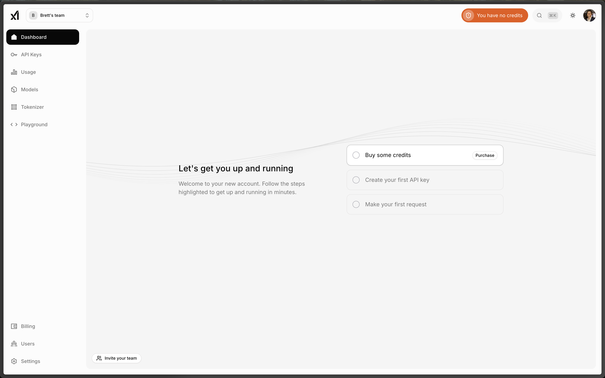
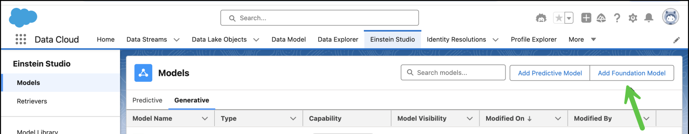
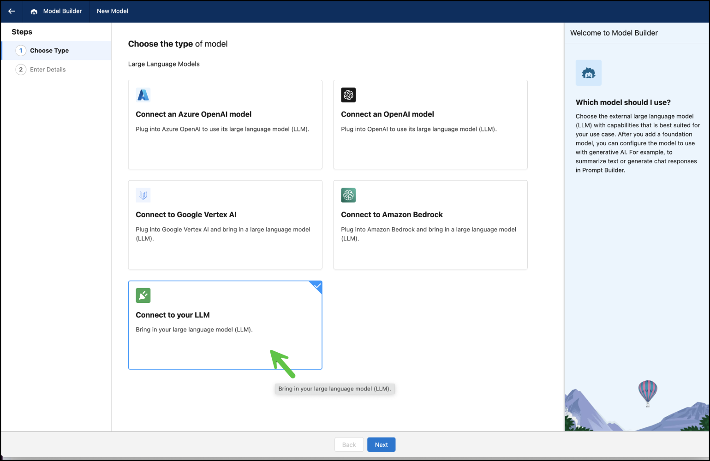
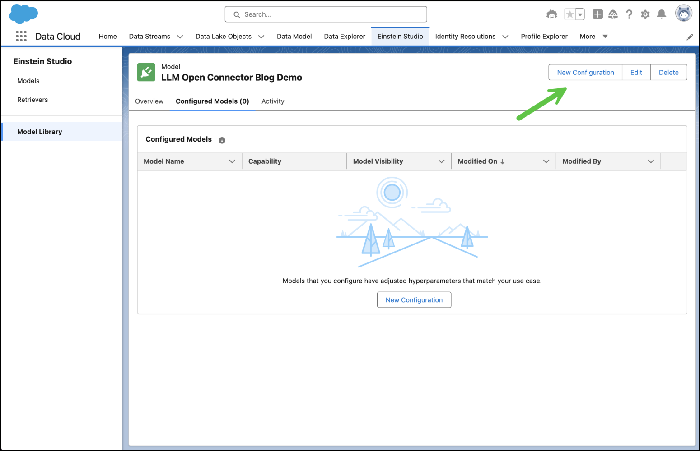

---
slug: grok
authors: [brettallenyo]
tags: [grok, llm-open-connector]
date: 2025-07-16
---

# LLM Open Connector + Grok

Learn how to implement Salesforce's [LLM Open Connector](/docs/apis/llm-open-connector/) with the xAI platform and [Grok](https://x.ai/news/grok-4). No custom scripts or deployments are required. Just plug in your xAI API key and you're off to the races.

<!-- truncate -->

## Prerequisites

1. If you don't already have one, [create an xAI account](https://accounts.x.ai/sign-up).
2. Create a team in the [xAI Cloud Console](https://console.x.ai/).
   
3. Purchase some xAI API credits.
4. Create an API key. Remember to save the secret somewhere secure!

## Integrate with Agentforce

xAI is fully compatible with the Open Connector API specification, so you can follow the LLM Open Connector [product guide](https://developer.salesforce.com/blogs/2024/10/build-generative-ai-solutions-with-llm-open-connector). Follow the steps in this post for a quick review.

### 1. Add a Foundation Model

### 2. Connect Your LLM

### 3. Enter Your xAI API Key

**TODO: insert screenshot**

- Add `https://api.x.ai/v1/chat/completions` to the **URL** field.
- Add your API secret to the **Auth Key** field.
- Add `grok-4` to the **Model Name** field.

### 4. Create A Configured Model

### 5. Start Using Grok

**TODO: insert screenshot**

## Wrapping Up

You’ve unlocked the power of [Grok 4](https://x.ai/news/grok-4) in Einstein Studio! You can leverage Grok’s advanced reasoning in your Agentforce application to handle complex requests and streamline workflows.

To monitor consumption, purchase additional credits, and manage your Grok models, use the [xAI Cloud console](https://console.x.ai/).
