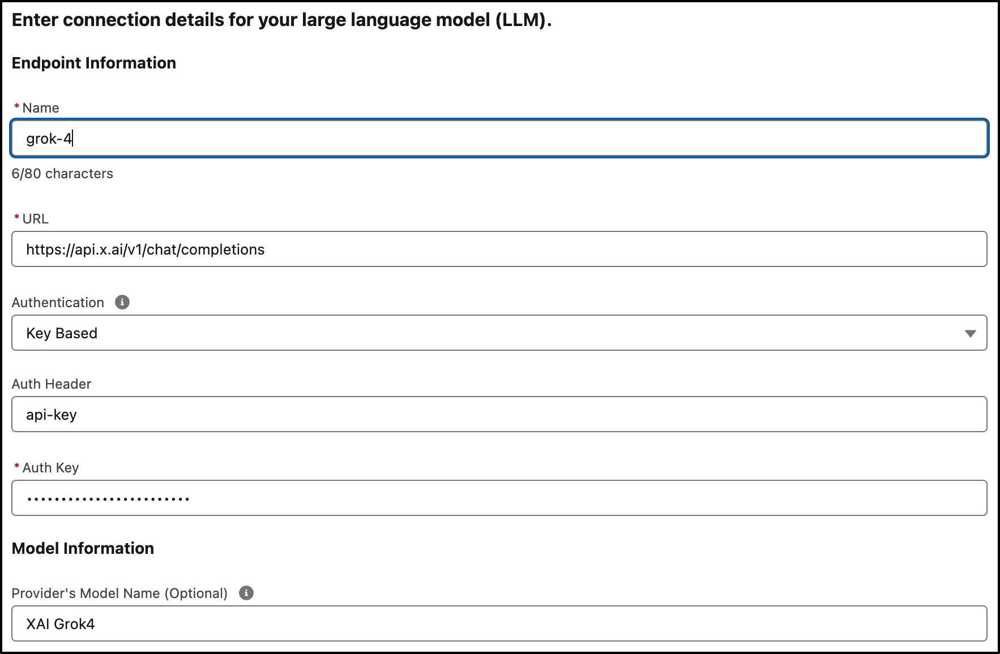
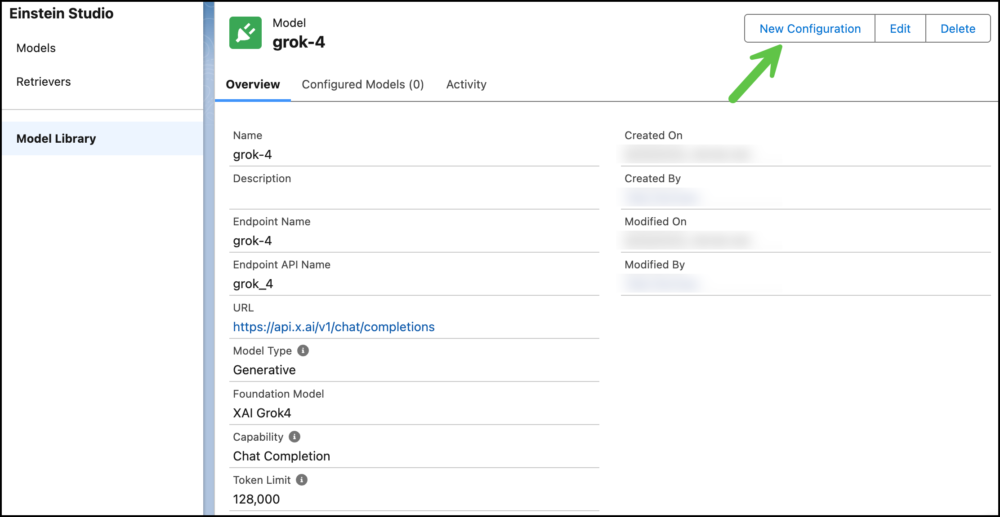

# LLM Open Connector + Grok

Learn how to implement Salesforce's [LLM Open Connector](/docs/apis/llm-open-connector/) with the xAI platform and [Grok](https://x.ai/news/grok-4). This blog walks through generating an xAI API key and creating a configured model in Salesforce. No custom scripts or deployments are required.

<!-- truncate -->

## Prerequisites

1. If you don't already have one, [create an xAI account](https://accounts.x.ai/sign-up).
2. Create a team in the [xAI Cloud Console](https://console.x.ai/).
   
3. Purchase some xAI API credits.
4. Create an API key.

## Integrate with Agentforce

xAI is fully compatible with the Open Connector API specification, so you can follow the LLM Open Connector [product guide](https://developer.salesforce.com/blogs/2024/10/build-generative-ai-solutions-with-llm-open-connector). Follow the steps in this post for an overview.

### Step 1. Add a Foundation Model

Navigate to Einstein Studio in Data Cloud.

### Step 2. Connect Your LLM

Select the option to bring your own model.

### Step 3. Enter Your xAI API Key

Enter your xAI details to create a new model connection in Model Builder.

- Add `https://api.x.ai/v1/chat/completions` to the **URL** field.
- Add your API secret to the **Auth Key** field.
- Add `grok-4` to the **Model Name** field.

### Step 4. Create A Configured Model

Before you can use your connected model, you need to create a configured model. Select grok-4 in the Model Library and click **New Configuration**.

Test your model in the the Model Playground. When you're ready, you can save your configuration and create the model for use in Salesforce.

### Step 5. Start Using Grok

You can now use [Grok 4](https://x.ai/news/grok-4) via Salesforce's Open Connector! You can leverage Grok’s advanced reasoning in your Agentforce application to handle complex requests and streamline workflows.

To monitor consumption, purchase additional credits, and manage your Grok models, use the [xAI Cloud console](https://console.x.ai/).