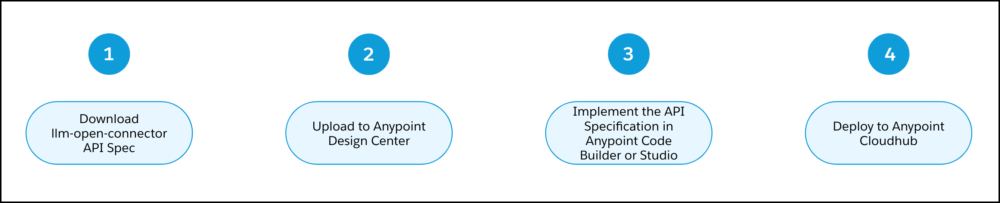
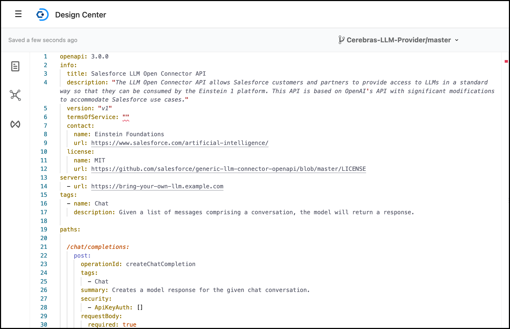
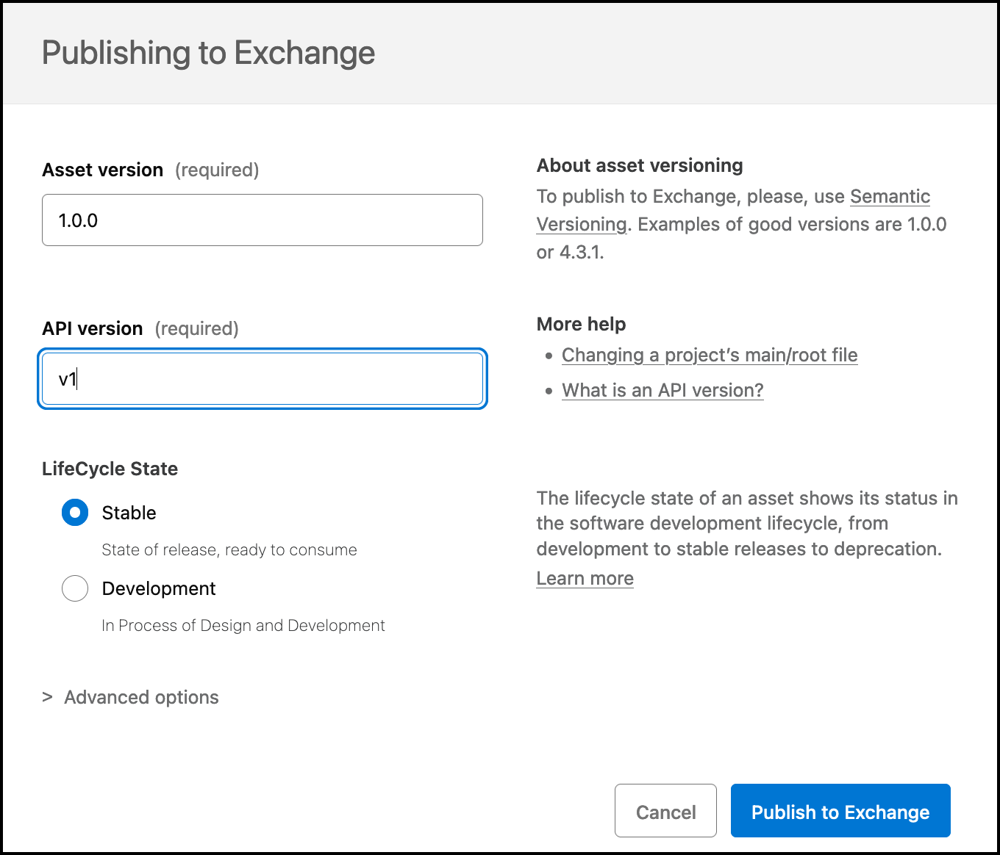
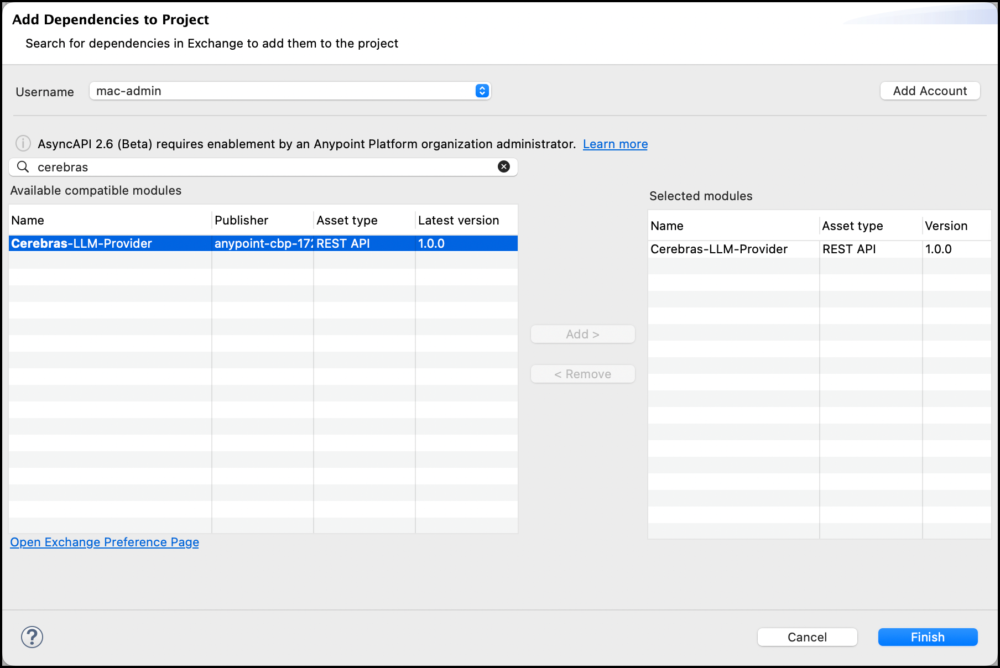
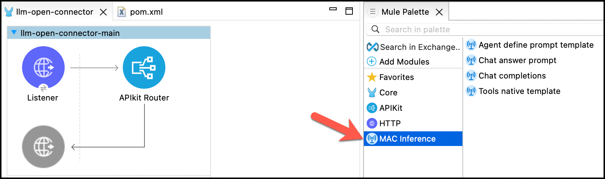
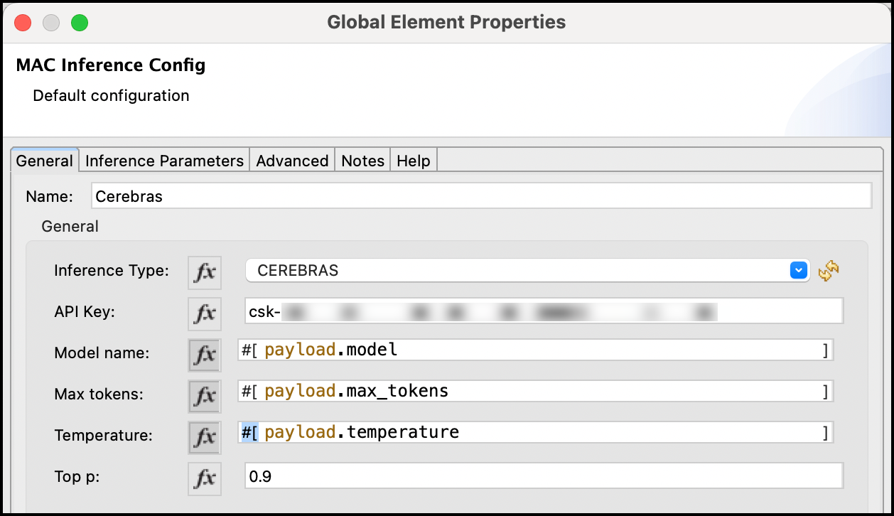
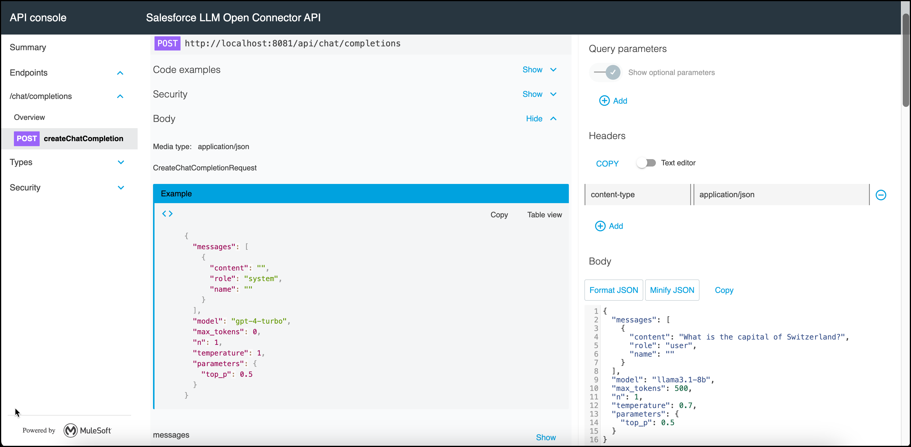
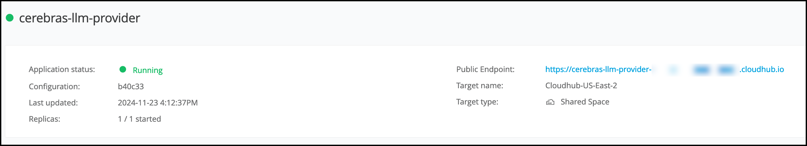
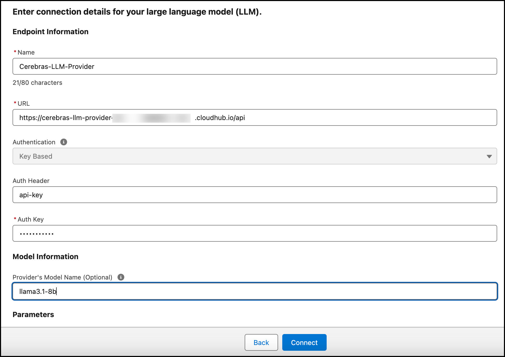
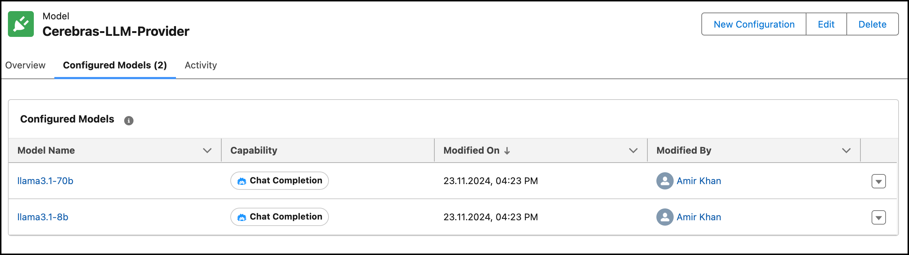

# LLM Open Connector + MuleSoft + Cerebras

Learn how to implement Salesforce's [LLM Open Connector](/docs/apis/llm-open-connector/) with MuleSoft Anypoint Platform using its [AI Chain Connector](https://mac-project.ai/docs/mulechain-ai/getting-started) and [Inference Connector](https://mac-project.ai/docs/mac-inference/getting-started). The steps in this recipe use AnyPoint Studio.

<!-- truncate -->

This recipe implements an example of a Cerebras Inference; however, the high-level process is the same for all models and providers.

## Tutorial Video + High-level Process

View a [step-by-step tutorial video](https://youtu.be/x4gMffK0Dek?si=Q9_3L__wno3Ca9uZ) that covers a similar implementation to the one covered in this recipe.

There are four steps that represent the high-level process of connecting your model endpoint in Mulesoft to the LLM Open Connector.



## Prerequisites

Before you begin, review these prerequisites:

1. You have a MuleSoft Account (Sign up at [anypoint.mulesoft.com/login/signup](https://anypoint.mulesoft.com/login/signup)).
2. You have [Anypoint Code Builder (ACB)](https://docs.mulesoft.com/anypoint-code-builder/start-acb-desktop) or [Anypoint Studio installed](https://www.mulesoft.com/lp/dl/anypoint-mule-studio). The instructions in this recipe are based on Anypoint Studio.
3. You have [Inference Connector](https://mac-project.ai/docs/mac-inference/getting-started) installed before you start.
4. You have a [Cerebras account](https://inference.cerebras.ai/) with an API key.

## Step 1: Download the API Specification for the LLM Open Connector

1. Download LLM Open Connector [API Spec](https://github.com/salesforce/einstein-platform/blob/main/api-specs/llm-open-connector/llm-open-connector.yml).

2. Rename the file from `llm-open-connector.yml` to `llm-open-connector.yaml`.

## Step 2: Import the API Specification into Anypoint Design Center

1. Log in to your MuleSoft account.

2. Go to [Anypoint Design Center](https://anypoint.mulesoft.com/designcenter/#/projects). 

3. Import a new API Specification from file using these values:
  - Project Name: `Cerebras-LLM-Provider`,
  - API Specification: Select `REST API`,
  - File upload: `llm-open-connector.yaml`, make sure to use the renamed file,
  - Click **Import**.

4. Verify that the API specification successfully imported. 



5. Change `termsOfService: ""` to `termsOfService: "-"`. 

6. Remove `servers:` and the example `url`. 

```
servers:
  - url: https://bring-your-own-llm.example.com
```

7. Click **Publish.** 

8. Provide versioning information and click **Publish to Exchange**:
  - Asset version: `1.0.0`
  - API version: `v1`
  - Lifecycle State: `Stable`



## Step 3: Implement the API Specification

This cookbook uses Anypoint Studio to implement the API Specification. If you prefer, you also can implement the spec with Anypoint Code Builder.

### Import API Specification into Studio

1. Open Anypoint Studio.

2. Create a Mule Project.

3. Name the project and import an API spec:
  - Project Name: `cerebras-llm-provider`, 
  - Import a published API: Select the `Cerebras-LLM-Provider` API spec from the previous step.



  - Click **Finish**.

4. The Mule Project is created. 

### Add Inference Connector to your project

1. If you have not installed the Inference Connector, [install it](https://mac-project.ai/docs/mac-inference/getting-started) before you start. 
2. Add the Inference Connector dependency to the Mule Project.

```xml
<dependency>
  <groupId>com.mulesoft.connectors</groupId>
  <artifactId>mac-inference-chain</artifactId>
  <version>0.1.0</version>
  <classifier>mule-plugin</classifier>
</dependency>
```
3. Make sure the Inference Connector is present in the Mule Palette.



### Implement the API

1. Go to the scaffolded flow `post:\chat\completions:application\json:llm-open-connector-config`.

2. Drag and drop `Chat completions` operation from the Inference Connector into the Flow.

3. Provide the Inference connector configuration for Cerebras.

4. Parametrize all properties needed by the LLM Open Connector API Spec.
.

5. In the `Chat completions` operation, enter: `payload.messages`. 

6. Before the `Chat completions` operation, add the `Set Variable` operation with the name `model` and enter in the expression value `payload.model`.

7. After the `Chat completions` operation, add the `Transform Message` operation and provide the mapping in this code block:

```json
%dw 2.0
output application/json
---
{
	id: "chatcmpl-" ++ now() as Number as String,
	created: now() as Number,
	usage: {
		completion_tokens: attributes.tokenUsage.outputCount,
		prompt_tokens: attributes.tokenUsage.inputCount,
		total_tokens: attributes.tokenUsage.totalCount
	},
	model: vars.model,
	choices: [
    	{
      finish_reason: "stop",
      index: 0,
      message: {
        content: payload.response default "",
        role: "assistant"
      }
    }
  ],
	object: "chat.completion"
}
```

8. Save the project.


### Test Locally

1. Start the Mule Application.

2. Go to the API Console.


3. Enter the API Key and following payload:

```json
{
  "messages": [
    {
      "content": "What is the capital of Switzerland?",
      "role": "user",
      "name": ""
    }
  ],
  "model": "llama3.1-8b",
  "max_tokens": 500,
  "n": 1,
  "temperature": 0.7,
  "parameters": {
    "top_p": 0.5
  }
}
```

4. Validate the result. Make sure the values are mapped correctly for token usage. 

```json
{
  "id": "chatcmpl-1732373228",
  "created": 1732373228,
  "usage": {
    "completion_tokens": 8,
    "prompt_tokens": 42,
    "total_tokens": 50
  },
  "model": "llama3.1-8b",
  "choices": [
    {
      "finish_reason": "stop",
      "index": 0,
      "message": {
        "content": "The capital of Switzerland is Bern.",
        "role": "assistant"
      }
    }
  ],
  "object": "chat.completion"
}
```

## Step 4. Deploy to Anypoint CloudHub

1. After the application is tested successfully, deploy it to Anypoint CloudHub.

2. Right-click your Mule Project and navigate to `Anypoint Platform` > `Deploy to CloudHub`.

3. Choose the environment you want to deploy to.

4. Enter the required values:
  - App name: `cerebras-llm-provider`
  - Deployment target: `Shared Space (Cloudhub 2.0)`
  - Replica Count: `1`
  - Replica Size: `Micro (0.1 vCore)`

5. Click **Deploy Application**.

6. Wait until the application is deployed. 




:::note
If you receive the error `[The asset is invalid, Error while trying to set type: app. Expected type is: rest-api.]`, go to Exchange and delete or rename the asset. [This error is a known issue](https://help.salesforce.com/s/articleView?id=001119384&type=1).
:::


## Configuration in Einstein Model Builder

1. After your API is deployed to CloudHub, go to Salesforce Einstein Model Builder in Data Cloud. 

2. Navigate to Einstein Studio.

3. Click **Add Foundation Model**, and click **Connect to your LLM**.

4. Click **Next**.

5. Enter the required values:
  - Name: `Cerebras-LLM-Provider`
  - URL: `<cloudhub_url>/api`
  - Model: For this recipe, model name is required. Choose between `llama3.1-70b` or `llama3.1-8b`.



6. Click **Connect**.

7. The Model Provider is added. 

8. Create two configurations for the supported models:
  - `llama3.1-70b`
  - `llama3.1-8b`



## Important Considerations

1. This cookbook uses Cerebras models:
  - `llama3.1-70b`
  - `llama3.1-8b`
2. When configuring through the Einstein Model Builder, you need to provide a default value for model. As in this recipe the model name is parametrized, a value is required. 
3. The API is fully under governance in the MuleSoft Anypoint Platform, which means: 
  - You can monitor the application by viewing logs and errors.
  - You can apply additional security using the API management capabilities of the Anypoint Platform.
  - You can deploy multiple replicas to scale horizontally and vertically.

## Conclusion
This cookbook demonstrates how to set up an LLM Open Connector using MuleSoft for the Chat Completion endpoints of Cerebras. This recipe is a sandbox implementation, and it's not production ready. For production use, please optimize your implementation based on your specific requirements and expected usage patterns.
