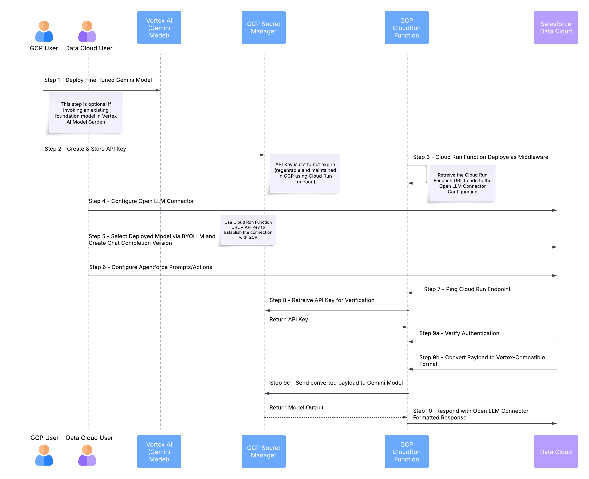

# LLM Open Connector + Vertex AI on Google Cloud Platform

Learn how to implement Salesforce's [LLM Open Connector](/docs/apis/llm-open-connector/) with the Google Cloud Platform (GCP).

<!-- truncate -->

## Overview

This document outlines detailed steps for using LLM Open Connector with Vertex AI on Google Cloud.

Instead of building custom, one-off integrations for each LLM vendor, the LLM Open Connector provides a standard API based on the OpenAI schema. LLM Open Connector provides a simple and quick path for teams to connect any model—be it enterprise-grade, open-source, or custom-trained—to Salesforce.

In this example, we will deploy a fine-tuned Gemini model from Google on Vertex AI Model Garden, use Google Cloud Run Functions (Gen 2\) for serverless compute, providing a scalable and maintainable solution that connects Salesforce to Vertex AI's model endpoints. This approach is particularly suited for Agentforce chat completion use cases, enabling advanced conversational AI capabilities within Salesforce.

## Background Information
This section introduces the products and features covered in the cookbook. If you're already familiar with LLM Open Connector, Google Cloud Platform (GCP), and Vertex AI feel free to skip to the next section.

1. Google Cloud equivalents to AWS services.   
   * **AWS Bedrock:** GCP's equivalent for hosting foundation models is **Vertex AI**. Vertex AI provides access to various models, including Google's own and other partner models. All models can be found in Model Garden   
   * **AWS Lambda:** GCP's serverless compute platform is **Cloud Functions**. This will host your code that interacts with the LLM.  
   * **AWS API Gateway:** GCP's API management service is **Cloud Endpoints** or **Cloud Functions (HTTP)**. These services create the API endpoint that the LLM Open Connector will call in Salesforce.  


2. Vertex AI offers a range of [foundation models](https://cloud.google.com/vertex-ai/generative-ai/docs/learn/models). This cookbook uses Gemini 1.5 Pro.
   * Text models, like PaLM 2, offer different sizes (e.g., Bison, Gecko) and are optimized for various tasks and performance requirements.  
   * Code models, for code generation and related tasks.  
   * Chat models, optimized for conversational interactions.  

## High-level Solution Components

1. A fine-tuned Gemini model deployed on Vertex AI (required for the cookbook). An end user can use any model as-is from Model Garden for their use case.
2. A Cloud Run Function that serves as a middleware, handling authentication and request/response transformation.
3. Secret Manager for secure API key storage.
4. Salesforce Einstein Studio configuration for the LLM Open Connector.

## High-level Solution Flow

In this scenario, we will deploy a fine-tuned Gemini Model in Google Cloud Platform and leverage Cloud Run Functions to authenticate the Data Cloud Open LLM Connector and invoke the Vertex Model endpoint. This setup is for Agentforce chat completion.



## Prerequisites

Before beginning the implementation, review the following requirements.

1. Google Cloud Account with appropriate permissions.  
   * Required project editor or equivalent roles.

   :::note
   If you’re new to Google Cloud, new customers get $300 in free credits to run, test, and deploy workloads as of 02/11/2025.
   :::

2. A Google Cloud project with billing enabled.
3. Google Cloud SDK (gcloud CLI). For installation instructions, see Install the gcloud CLI and Set up gcloud CLI. The cookbook walks through the following prerequisites. 
   * On the project selector page in the Google Cloud console, select or create a Google Cloud project.  
   * Make sure that billing is enabled for your Google Cloud project.  
   * Review documentation for setting up Google Cloud SDK (gcloud CLI)[https://cloud.google.com/sdk/docs/install-sdk](https://cloud.google.com/sdk/docs/install-sdk). 
4. Python 3.9 or later.
5. Access to Vertex AI. You may need to enable the Vertex AI API in your project via the Google Cloud Console if it's not already enabled.
6. Enable all other APIs for this cookbook:
      * Vertex AI API  
      * Cloud Run API  
      * Secret Manager API  
      * Cloud Build API  
      * Any additional APIs as required by Google Cloud UI.


## Implementation Steps

### 1. Fine-tune Your Gemini Model

Fine-tuning a Gemini model allows you to customize its responses for your specific use case. Here's how to set it up:

1. Access Vertex AI Model Garden:  
   * Go to the Google Cloud Console.  
   * Go to Vertex AI > Model Garden.  
   * Search for "Gemini".  
   * Select "gemini-1.5-pro" (non-streaming version).


2. Prepare your training data. The training data must be in JSONL format, with each line containing a complete conversation example. The following template represents the required structure:

    ```json
    {"contents": [{"role": "user", "parts": [{"text": "Your question here"}]}, {"role": "model", "parts": [{"text": "Expected response here"}]}]}
    ```

    Refer to the following test data sample:


    ```json
    {"contents": [{"role": "user", "parts": [{"text": "Based on sensor data, what is the recommended maintenance interval for CNC Lathe Alpha?"}]}, {"role": "model", "parts": [{"text": "CNC Lathe Alpha should be maintained every 5 months, especially if sensor readings show vibration levels above 2.5 m/s² or temperatures exceeding 80°C."}]}]}

    {"contents": [{"role": "user", "parts": [{"text": "What maintenance schedule does CNC Milling Beta require according to the latest IoT data?"}]}, {"role": "model", "parts": [{"text": "CNC Milling Beta should be scheduled for maintenance every 6 months. Abnormal spindle temperatures above 85°C or increased vibrations may indicate the need for earlier service."}]}]}

    {"contents": [{"role": "user", "parts": [{"text": "From the IoT sensor analysis, what maintenance interval is recommended for Hydraulic Press Delta?"}]}, {"role": "model", "parts": [{"text": "Hydraulic Press Delta is recommended to be maintained every 4 months. Sudden drops in hydraulic pressure or unexpected increases in acoustic emissions should prompt earlier service."}]}]}

    {"contents": [{"role": "user", "parts": [{"text": "According to sensor readings, how often should Robotic Arm Omega be serviced?"}]}, {"role": "model", "parts": [{"text": "Robotic Arm Omega should be serviced every 7 months, with earlier checks if joint torque variability exceeds 10% or if motor temperatures spike unexpectedly."}]}]}

    {"contents": [{"role": "user", "parts": [{"text": "What maintenance interval does the sensor data suggest for Injection Molder Sigma?"}]}, {"role": "model", "parts": [{"text": "Injection Molder Sigma should undergo maintenance every 8 months. Notable increases in heating element temperature or pressure fluctuations indicate the need for an earlier service."}]}]}

    {"contents": [{"role": "user", "parts": [{"text": "Based on current IoT readings, what maintenance frequency is recommended for Conveyor Belt Gamma?"}]}, {"role": "model", "parts": [{"text": "Conveyor Belt Gamma is best maintained every 3 months, especially if sensor data shows inconsistent belt speeds or abnormal motor vibrations."}]}]}

    {"contents": [{"role": "user", "parts": [{"text": "What does the IoT data recommend for the maintenance schedule of Packaging Machine Epsilon?"}]}, {"role": "model", "parts": [{"text": "Packaging Machine Epsilon should be maintained every 6 months. Spikes in vibration levels or minor misalignments detected by sensors suggest that prompt maintenance may be necessary."}]}]}

    {"contents": [{"role": "user", "parts": [{"text": "How often should Press Brake Zeta be serviced according to sensor trends?"}]}, {"role": "model", "parts": [{"text": "Press Brake Zeta should be serviced every 5 months. Consistent monitoring of force output and temperature is crucial; significant deviations indicate that earlier service might be required."}]}]}

    {"contents": [{"role": "user", "parts": [{"text": "Based on sensor insights, what is the recommended maintenance interval for Laser Cutter Theta?"}]}, {"role": "model", "parts": [{"text": "Laser Cutter Theta is recommended to be maintained every 4 months. Increases in ambient dust levels or fluctuations in laser power readings are critical indicators for timely maintenance."}]}]}

    {"contents": [{"role": "user", "parts": [{"text": "What maintenance schedule should be followed for Drilling Machine Kappa based on IoT data?"}]}, {"role": "model", "parts": [{"text": "Drilling Machine Kappa should be maintained every 6 months, with special attention if there are sudden spikes in vibration or drilling temperature that may signal an urgent service need."}]}]}
    ```

3. Create and Configure the Tuning Job:
    * Go to Vertex AI → Training.  
    * Click **Create Training Job**.  
    * Select your fine-tuning dataset  
    * Configure the hyperparameters (start with defaults).
    * Start the training job.

4. Deploy the Fine-tuned Model:
    * After you complete training, go to the model in Vertex AI.  
    * Click **Deploy**.  
    * Select region (e.g., `us-central1`).  
    * Store the following information:  
        * Endpoint Name  
        * Endpoint ID  
        * Location  
        * Project ID


### 2. Create and Configure Your Secrets in Google Cloud

The LLM Open Connector requires an API key for authentication. We'll store this securely in Google Cloud Secret Manager.

1. Go to Secret Manager:  
   * Open Google Cloud Console.  
   * Go to Security → Secret Manager  
   * Click **CREATE SECRET**.  
2. Configure the secret:  
   * Name: `llm_connector_api_key`
   * Upload a pre-generated API key -- you'll need this when configuring your model in Salesforce.
   * Click **CREATE SECRET**.  

    :::note
    For the cookbook, we set this key to never expire. GCP takes care of rotating the encryption key. However, a different Cloud Run function can be set to rotate the API key. When a new key is generated in GCP, the Open LLM Connector API key needs to be updated.
    :::

3. Verify the secret creation. You should see your secret listed in Secret Manager. The "Resource ID" will be in the format: `projects/{PROJECT_ID}/secrets/llm_connector_api_key`.
4. Configure IAM Permissions. Ensure your Cloud Run Function's service account has the following roles:  
    * Secret Manager Secret Accessor  
    * Vertex AI User  
    * We recommend creating an easily identifiable dedicated Cloud Run function service account and provide all required permissions to this service account for this cookbook. The user is open to use other service accounts as well.


### 3. Implement the Cloud Run Function

The Cloud Run Function serves as middleware between Salesforce and Vertex AI. Follow the steps to implement it.

1. Create the Function Code with at least the minimum required settings.
    * Trigger type: HTTPS  
    * Choose a dedicated service account-- this has access to the secrets as well.
    * Runtime python 3.10  
2. Configure environment variables:  
   * Project ID  
   * Location   
   * Endpoint ID (fine-tuned model endpoint)  
3.  Create a new directory for your function and add the following files:  
    * main.py: `openllmconnectormain.py` 
    * `requirements.txt`:
        ```txt
        functions-framework==3.*
        google-cloud-aiplatform==1.*
        google-cloud-secret-manager==2.*
        flask==2.*
        ```
4.  Test and deploy the function.

## 4. Create a Configured Model in Salesforce

1. In your Salesforce Org, open Data Cloud.
2. Go to Einstein Studio, go to Model Builder. 
3. Click **New Configuration**.
4. Select "LLM Open Connector".
5. Enter Configuration Details:  
   * Endpoint URL: `https://{REGION}-{PROJECT_ID}.cloudfunctions.net/llm\_connector/chat/completions`
   * Auth Header: api-key  
   * Auth Key: `{VALUE_FROM_SECRET_MANAGER}` 
   * Model Name: `{FINETUNED_MODEL_NAME}`    
6. After the connection is successful, select and test the fine-tuned model in Model Garden. 
7. Adjust temperature settings and create a chat completions version for use in Salesforce. Congratulations! Your Vertex AI model is now ready to use!


## See Also
* [LLM Open Connector + AWS](./llm-open-connector-aws.md)
